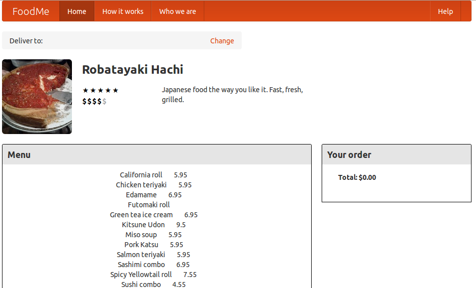
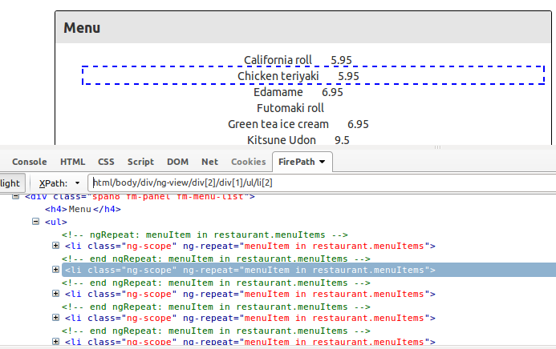
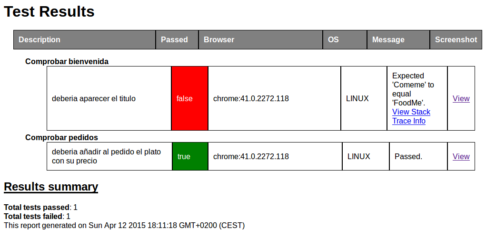

# 1. PRIMEROS PASOS - NUESTRA APLICACIÓN DE EJEMPLO

La aplicacion sobre la que vamos a realizar nuestras pruebas está basada en [Foodme](https://github.com/IgorMinar/foodme).

NOTA: Se ha adaptado el código para que funcione con versiones superiores del stack (angular, express).

**Para visualizar la aplicación ubicarse en el directorio /projects/foodme y ejecutar el arranque del servidor:**

      ./scripts/web-server.sh

Automáticamente se nos abrirá el navegador con la página principal de la aplicación:


Navegar durante 2-3 minutos por la aplicación para comprobar la funcionalidad existente.

# 2. PRUEBAS UNITARIAS - Un ejemplo basico para entender Jasmine

[Información sintaxis Jasmine](http://jasmine.github.io/2.2/introduction.html)

Vamos a revisar un ejemplo básico para conocer la sintaxis del framework de testing y entender el funcionamiento de TDD. 

Queremos crear una calculadora que suma y resta. Según nos explican 3 + 7 debería dar como resultado 10.

1. Acceder a la carpeta 'projects/foodme/test/unit'
2. Definimos la prueba antes que el código: 'test/unit/specs/calculator_spec.js'
(siempre tenemos que nombrar con el sufijo 'spec.js',para que jasmine-node los ejecute por defecto)
  ```javascript
  // Pruebas unitarias de una calculadora
  var calc = require('../calculator.js')

    describe('Calculadora', function() {

      beforeEach(function() {
      });

      afterEach(function() {        
      });

      describe('sumar', function() {
        it('deberia sumar 3 y 7 y devolver 10', function() {
          var result = calc.add(3,7);
          expect(result).toBe(10);
        });
      });
  });
  ```
3. Ejecutar en la consola:
    jasmine-node --autotest

Ver el resultado que falla.

4. Realizar el mínimo código para que funcione (foodme/test/unit/calculator.js)
```javascript
exports.add = function(a,b) {
  return 10;
}
```

5. Volver a ejecutar la prueba.
6. Añadir una nueva condición para que falle

  ```javascript
    // Pruebas unitarias de una calculadora
    var calc = require('./calculator.js')
      describe('Calculadora', function() {

        beforeEach(function() {
        });

        afterEach(function() {        
        });

        describe('sumar', function() {
          it('deberia sumar 3 y 7 y devolver 10', function() {
            var result = calc.add(3,7);
            expect(result).toBe(10);
          });

          it('deberia sumar -2 y 8 y devolver 6', function() {
            var result = calc.add(-2,8);
            expect(result).toBe(6);
          });
        });
      });
  ```
7. Hacer la refactorización para que no falle:

  ```javascript
  exports.add = function(a,b) {
    return a+b;
  }
  ```
8. Volver a ejecutar la prueba

## PRACTICA: Definir un caso unitario para el cálculo de descuentos

Imaginemos que nuestro cliente quiere aplicar descuentos en la compra de platos en las siguientes condiciones:

- Si se dispone de un vale descuento (por una compra anterior) se aplica un descuento del 5%
- Si la compra actual supera los 50 euros se descuenta del precio un 5%
- Si la compra actual supera los 100 euros se descuenta del precio un 10%

Fichero 'test/unit/calculator_discount.js':

  ```javascript
  exports.getDiscountByVale = function(active) {
    if (active) return 0.5;
    else throw new Error('El vale ha caducado');
  }
  exports.getDiscountByPrice = function(price) {
    if (price>100) return 0.1; 
    else if (price>50) return 0.05; 
  }
  ```

**TAREA**: Implementar  pruebas unitarias de estas funciones para comprobar si fallan o no en base a algún valor.

*Considerar diferentes cambios habituales de errores de programadores (sobre valores límite, poner el if antes, ...)*

---
	 var calc = require('../calculator_discount.js')

	 describe('Calculo descuento compra', function() {
	  
	  describe('calcular descuento por vale', function() {
	    it('deberia devolver un descuento del 5% si el vale es activo', function() {
	      expect(calc.getDiscountByVale(true)).toEqual(0.5);
	    });

	    it('deberia devolver un mensaje de error si el vale es inactivo', function() {
	      expect(function() {
	        calc.getDiscountByVale(false);
	      }).toThrow(new Error('El vale ha caducado'));
	    });
	  });

	  describe('calcular descuento por precio de compra', function() {
	    it('deberia devolver un descuento del 5% si el precio supera los 50 euros', function() {
	      expect(calc.getDiscountByPrice(51)).toBe(0.05);
	    });

	    it('deberia devolver un descuento del 10% si el precio supera los 100 euros', function() {
	      expect(calc.getDiscountByPrice(200)).toBe(0.1);
	    });
	  });
	});


# 3. PRUEBAS DE COMPONENTE

Objetivo: Especificar una prueba de integración para el controlador de Restaurantes y comprobar que filtra correctamente la lista de restaurantes en base al filtro de rating. Comprobar el uso de test doubles para simular los datos del servidor, y evitar asi pruebas dependientes de la infraestructura. 

## 3.1 Configuración de karma para la aplicación

El fichero karma de configuración de nuestro proyecto indicará la ubicación de nuestros ficheros de pruebas y otras variables.

    cd test/component
    karma init

Aparecerán varias preguntas. Dar las siguientes respuestas:

    Which testing framework do you want to use ?
    Press tab to list possible options. Enter to move to the next question.
    > jasmine
     
    Do you want to use Require.js ?
    This will add Require.js plugin.
    Press tab to list possible options. Enter to move to the next question.
    > no
     
    Do you want to capture a browser automatically ?
    Press tab to list possible options. Enter empty string to move to the next question.
    > Chrome
    >
     
    What is the location of your source and test files ?
    You can use glob patterns, eg. &quot;js/*.js&quot; or &quot;test/**/*Spec.js&quot;.
    Enter empty string to move to the next question.
    > 

    Should any of the files included by the previous patterns be excluded ?
    You can use glob patterns, eg. &quot;**/*.swp&quot;.
    Enter empty string to move to the next question.
    >
     
    Do you want Karma to watch all the files and run the tests on change ?
    Press tab to list possible options.
    > yes


Abrir el fichero creado 'karma.config.js' y configurar las rutas a los ficheros de prueba y de aplicación:

	   files: [
	      'app/lib/angular/angular.js',
	      'app/lib/angular/angular-*.js',
	      'test/lib/angular/angular-mocks.js',
	
	
	      'app/js/**/*.js',
	      'test/component/**/*.js'
	    ],

## 3.2 Revisar el contenido del código controlador de la aplicación y el código de prueba de integración para comprobar el filtrado

Fichero: foodme/app/js/controllers/RestaurantsController.js

```javascript
 var allRestaurants = Restaurant.query(filterAndSortRestaurants);
  
  $scope.$watch('filter', filterAndSortRestaurants, true);

  function filterAndSortRestaurants() {
    $scope.restaurants = [];

    // filter
    angular.forEach(allRestaurants, function(item, key) {
      if (filter.price && filter.price !== item.price) {
        return;
      }

      if (filter.rating && filter.rating !== item.rating) {
        return;
      }

      if (filter.cuisine.length && filter.cuisine.indexOf(item.cuisine) === -1) {
        return;
      }

      $scope.restaurants.push(item);
    });
    ...
```

## 3.3. Crear la prueba

Desde el propio Angular existe una librería para mocks, que nos permite actuar como un Test Double y devolver valores predefinidos.

Usaremos la función:

    $httpBackend.whenGET(...)

Y tenemos que inyectar ante cualquier llamada a la url de obtención de restaurantes esta función.


  beforeEach(inject(function($controller, $httpBackend, $rootScope) {
      scope = $rootScope;

      $httpBackend.whenGET('/api/restaurant').respond(RESPONSE);
      $controller('RestaurantsController', {$scope: scope});

      $httpBackend.flush();
    }));


*NOTA: Estamos obviando TDD para ir un poco mas rápido, pero no tenemos que olvidar lo que hemos visto anteriormente*

## 3.5. Ejecutar la prueba

```karma start```


# 4. PRUEBAS DE ACEPTACIÓN
Objetivo: Especificar una prueba de aceptación, basada en interfaz de usuario.

Revisar https://angular.github.io/protractor/#/

## 4.1 Prueba que comprueba el título de la página

1. Crear fichero 'projects/foodme/test/acceptance/conf.js':

    ```javascript
    // conf.js
    exports.config = {
      seleniumAddress: 'http://localhost:4444/wd/hub',
      specs: ['spec.js']
    }
    ```
2. Crear fichero de especificaciones de prueba 'projects/foodme/test/acceptance/spec.js':

    ```javascript
        describe('UPC Foodme test titulo', function() {
          it('comprobar el titulo', function() {
            browser.get('http://localhost:3000/#/');
            expect(browser.getTitle()).toEqual('FoodMe');
          });
        });
    ```

3. Ejecutar las pruebas:

    En una consola ejecutar:

        sudo webdriver-manager start

    Abrir otra consola y ejecutar:

        protractor conf.js

    NOTA: Previamente hay que arrancar la aplicación.

4. Cambiar el código de la página 'index.html' para verificar que ahora la prueba falla, cambiando el título de la página.

  ```html
  <head>
    <meta charset="utf-8">
    <title>Cómeme</title>
    ...
  </head>
  <body>
  ```

## 4.2 Prueba para comprobar que el precio de la cesta es el del plato escogido

+ Acceder a la aplicación en el enlace [http://localhost:3000/#/menu/robatayaki
](http://localhost:3000/#/menu/robatayaki).



+ Para obtener los atributos y valores del DOM de HTML usamos selectores. 
[Ver tutorial locators](http://angular.github.io/protractor/#/locators)

+ Para ayudarnos a saber como seleccionar un elemento concreto de una página podemos usar herramientas plugin de los navegadores: Firefox Developer, Firepath (para XPath)


**Realizar la prueba que compruebe si el precio de la cesta es el del plato escogido**


## 4.3 Generar informe de las pruebas

Modificar el fichero de configuración conf.js:

```javascript
var HtmlReporter = require('protractor-html-screenshot-reporter');
// conf.js
exports.config = {
  seleniumAddress: 'http://localhost:4444/wd/hub',
  specs: ['spec.js'],

  onPrepare: function() {
      // Add a screenshot reporter and store screenshots to `/tmp/screnshots`: 
      jasmine.getEnv().addReporter(new HtmlReporter({
         baseDirectory: './results'
      }));
   }
}
```

Volver a ejecutar `protractor conf.js`

Abrir el informe generado 'report.html' del directorio '/test/system/results':



# 5. PRUEBAS DE ACEPTACIÓN CON BDD "REAL"
Objetivo: Especificar una prueba de aceptación basada en BDD (Behaviour Driven Development)

## Prueba con BDD

    Scenario: Visitar restaurante
      Given Veo el listado de restaurantes
      When Selecciono un restaurante
      Then Deberia ver un titulo con el nombre del restaurante

NOTA: Hemos escogido esta prueba por su simplicidad. 

1. Configurar protractor 'test/bdd/protractor.conf'

  ```javascript
  exports.config = {
    specs: [
      './features/**/*.feature'
    ],
    capabilities: {
      'browserName': 'chrome'
    },
    baseUrl: 'http://localhost:8081/',
    framework: 'cucumber'
  };
  ```
2. Crear el escenario 'test/bdd/features/homepage.feature'
  ```
    Feature: Añadir platos a mi pedido 
      Como usuario
      Quiero poder seleccionar platos de diferentes restaurantes
      Para poder realizar la compra

      Scenario: Añadir un plato a mi pedido vacio
        Given Veo el listado de restaurantes
        When Selecciono un restaurante
        Then Deberia ver un titulo
  ```
3. Crear los pasos de la prueba 'test/bdd/features/homepage-steps.js'

    ```javascript
    'use strict';

    var expect = require('chai').expect;
    var HomePage = require('../pages/home_page.js');
    var steps = function() {

      this.Given(/^Veo el listado de restaurantes$/, function(done) {
        // callback.pending();
        browser.get('http://localhost:3000/index.html#/customer');
        // fill in the customer, so that we navigate to restaurants list
        element(by.model('customerName')).sendKeys('Xavier');
        element(by.model('customerAddress')).sendKeys('Mi direccion');
        element(by.css('.btn-primary')).click();
      });

      this.When('Selecciono un restaurante', function (done) {
          callback.pending();
      });

      this.Then('Deberia ver un titulo', function(callback) {
          callback.pending();
      });
    };

    module.exports = steps;
    ```
4.  Ejecutar la prueba

	- En una consola ejecutar
    ```
    sudo webdriver-manager start
    ```
	- En la consola, ubicados en el directorio '/test/bdd':

		```
    protractor protractor.js
    ```

# 5. PRUEBAS DE ACEPTACIÓN DESCONECTADAS DE LA INTERFAZ DE USUARIO

## 5.1 Patrón Window Driver

En el caso de Jasmine el patrón **Window Driver** se denomina **PageObjects**

¿Como definiríamos el acceso a la página principal (HomePage)?

1. Definir en el fichero 'home_page.js' la página:

    ```javascript
    var HomePage = (function () {
        function HomePage() {
            this.url = 'http://localhost:3000/index.html#/customer';
            this.customerNameInput = element(by.model('customerName'));
            this.customerAddressInput = element(by.model('customerAddress'));
            this.submitBtn = element(by.css('.btn-primary'));
        }

        HomePage.prototype.visit = function () {
            browser.get(this.url);
        };

        HomePage.prototype.login = function (name, address) {
            this.customerNameInput.sendKeys(name);
            this.customerAddressInput.sendKeys(address);
            this.submitBtn.click();
        };

        return HomePage;
    })();

    module.exports = HomePage;
    ```

2. Actualizar la prueba de la sección anterior usando el código:

    ```javascript
    'use strict';

    var expect = require('chai').expect;
    var HomePage = require('../pages/home_page.js');

    var steps = function() {
      var page = new HomePage();

      this.Given(/^Veo el listado de restaurantes$/, function(callback) {    
        page.visit();
        page.login('Xavier','Mi direccion');    
      });

      this.When('Selecciono un restaurante', function (done) {      
          callback.pending();
      });

      this.Then('Deberia ver un titulo', function(done) {
          callback.pending();
      });
    };

    module.exports = steps;
    ```

##  5.2 Pruebas de API o servicios

En nuestra aplicación de ejemplo los servicios están definidos con REST y JSON.Usaremos para las pruebas el framework *frisbyjs*.

Consultar [http://frisbyjs.com](http://frisbyjs.com).

¿Cómo realizaremos la prueba de consultar el restaurante 'robatayaki' y su primer plato?

NOTA: Usar Firebug para revisar la petición y datos recibidos en JSON por REST.

# REFERENCIAS

* [Guía angular para pruebas e2e](https://docs.angularjs.org/guide/e2e-testing)
* [Guía Karma y Jasmine](http://www.tuesdaydeveloper.com/2013/06/angularjs-testing-with-karma-and-jasmine/)
* [Guía pruebas end to end](http://engineering.wingify.com/posts/e2e-testing-with-webdriverjs-jasmine/)


